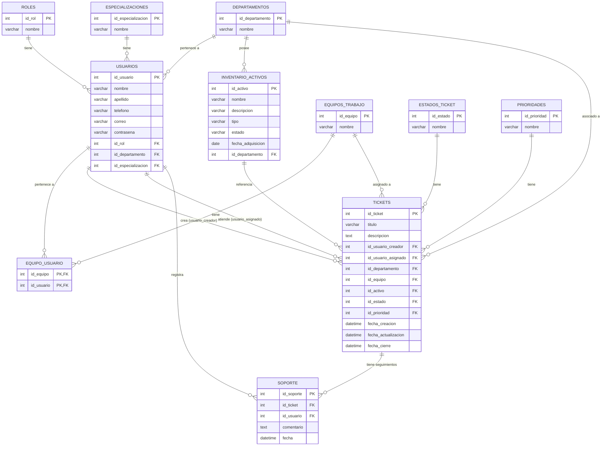

# Modelo Relacional — Base de Datos "Tickets de Reporte"

## 1. Supuestos tomados a partir del boceto

Tu boceto en Excalidraw definía completamente **Usuarios, Especializacion, Departamentos y EquipoDeTrabajo**, pero **Tickets, Soporte e InventarioActivos** solo aparecían nombradas, sin atributos. Para completar el modelo asumí lo siguiente (ajustable):

- **Roles**: como `Usuarios` tenía un campo `(fk) Rol -> number` pero no había tabla `Rol` dibujada, la agregué como catálogo (Administrador, Soporte, Usuario Final).
- **Tickets**: un ticket lo crea un usuario, opcionalmente se asigna a un usuario de soporte y/o a un equipo de trabajo, tiene estado y prioridad, y puede referenciar un activo del inventario (ej. "la impresora X no funciona").
- **Soporte**: la interpreté como el **historial de seguimiento/comentarios** que el personal de soporte agrega a un ticket (bitácora de atención), no como una tabla separada de personas (esas ya son `Usuarios` con rol Soporte).
- **InventarioActivos**: equipos/activos de la empresa (PC, impresoras, etc.) que pueden estar asociados a un departamento y referenciados por un ticket.
- **Estado** y **Prioridad** del ticket los modelé como catálogos separados (mejor práctica que un `ENUM` fijo, permite agregar nuevos estados sin alterar la tabla).
- La relación `EquipoDeTrabajo` ↔ `Usuarios` es muchos-a-muchos (un equipo tiene varios integrantes, un usuario puede pertenecer a varios equipos), así que agregué la tabla intermedia `equipo_usuario`.

## 2. Diagrama Entidad-Relación

## 3. Resumen de tablas y relaciones

| Tabla | Descripción | Relación clave |
|---|---|---|
| `roles` | Catálogo de roles (Admin, Soporte, Usuario Final) | 1:N con `usuarios` |
| `departamentos` | Departamentos de la empresa | 1:N con `usuarios`, `inventario_activos`, `tickets` |
| `especializaciones` | Especialidad del personal de soporte | 1:N con `usuarios` |
| `usuarios` | Todas las personas del sistema | Referenciada por casi todo |
| `equipos_trabajo` | Equipos de soporte | N:M con `usuarios` vía `equipo_usuario` |
| `equipo_usuario` | Tabla intermedia equipo-usuario | N:M |
| `inventario_activos` | Equipos/activos físicos | 1:N con `tickets` |
| `estados_ticket` | Catálogo de estados (Abierto, En progreso, Cerrado...) | 1:N con `tickets` |
| `prioridades` | Catálogo de prioridad (Baja, Media, Alta, Urgente) | 1:N con `tickets` |
| `tickets` | Reportes/incidencias | Núcleo del sistema |
| `soporte` | Bitácora de seguimiento de un ticket | 1:N desde `tickets` |
